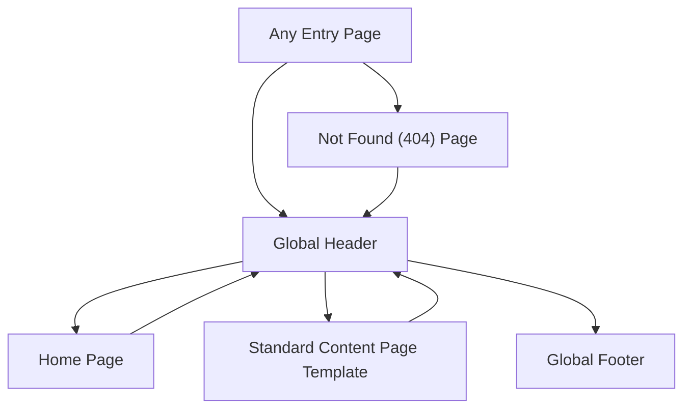

## 1. Product Overview
Unify navigation and visual theme across the entire site by introducing a shared header/footer, a single set of styling tokens, and a consistent routing/navigation model.
This reduces user confusion, improves brand cohesion, and makes future page additions faster and safer.

## 2. Core Features

### 2.1 User Roles
| Role | Registration Method | Core Permissions |
|---|---|---|
| Visitor | None | Can browse pages and use global navigation consistently across the site. |

### 2.2 Feature Module
1. **Global Site Shell (applies to every page)**: shared header, shared footer, consistent content container, consistent active-nav behavior.
2. **Home Page**: uses the same global site shell; primary entry point into top-level sections.
3. **Standard Content Page Template**: consistent page hero/title treatment, consistent spacing and typography, consistent in-page navigation behavior.
4. **Not Found (404) Page**: same global site shell; clear recovery paths via primary navigation.

### 2.3 Page Details
| Page Name | Module Name | Feature description |
|---|---|---|
| Global Site Shell (All pages) | Shared Header | Provide one header used site-wide: logo/home link, primary navigation, optional primary CTA, and clear active state for current section. |
| Global Site Shell (All pages) | Shared Footer | Provide one footer used site-wide: secondary navigation links and consistent copyright/brand line. |
| Global Site Shell (All pages) | Theme Tokens | Centralize core styling decisions (colors, typography, spacing, radii, shadows) and apply consistently across components and pages. |
| Global Site Shell (All pages) | Routing & Nav Model | Define a single canonical set of top-level routes shown in navigation; ensure nav highlights match routes; prevent duplicate/competing nav patterns across pages. |
| Home Page | Consistent Layout Usage | Render home content inside the global shell with the same container widths, headings, and section spacing used elsewhere. |
| Standard Content Page Template | Consistent Page Structure | Render content pages with a shared pattern: page header (title + brief intro), main content blocks, consistent section spacing and heading hierarchy. |
| Standard Content Page Template | Link & CTA Styling | Apply a unified link and button style (default, hover, focus) so CTAs look and behave the same on every page. |
| Not Found (404) Page | Recovery Navigation | Provide clear actions to return to home and navigate via the global header/footer without dead ends. |

## 3. Core Process
- Visitor lands on any page and immediately sees the same header and footer.
- Visitor uses the header primary navigation to move between top-level sections; the active section is always highlighted.
- Visitor scans any page with the same typography scale and spacing rhythm, making content easier to compare and trust.
- If a visitor hits an unknown route, the 404 page provides clear navigation back to known sections.

