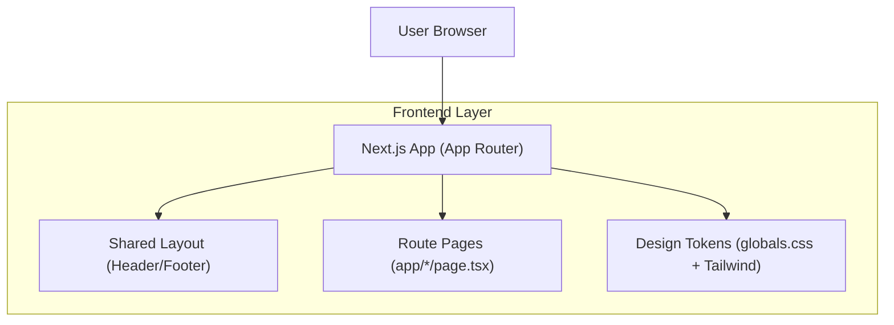

## 1.Architecture design

## 2.Technology Description
- Frontend: Next.js@15 (React@19) + TypeScript@5
- Styling: Tailwind CSS@4 (tokenized via CSS variables / @theme)
- Icons/UI: lucide-react (+ existing local UI components)
- Backend: None required for navigation/theme consistency (existing Next.js route handlers remain unchanged)

## 3.Route definitions
| Route | Purpose |
|---|---|
| / | Home page entry point |
| /solutions | Solutions landing |
| /solutions/[industry] | Industry-specific solution detail |
| /benefits | Benefits overview |
| /case-studies | Case studies overview |
| /technology | Technology overview |
| /trust-demo | Trust demo experience |
| /trust-dashboard | Trust dashboard experience |
| /security-monitor | Security monitor page |
| /demo | Demo landing |
| /contact | Contact page |
| /changelog | Product changelog |
| /sitemap | Human-readable sitemap page |

## 4.Implementation notes (site-wide consistency)
- Shared shell: render a single Header + Footer from the root `app/layout.tsx` so every route inherits it.
- Nav source of truth: define one nav config object (labels + href + matching rules) and reuse in header/footer; avoid per-page nav duplication.
- Active state: compute active section from the current pathname (exact match + prefix match rules) and render a consistent active style.
- Tokens: expand `globals.css` tokens (background/foreground + brand/accent + border + radius + shadow + typography scale) and consume them through Tailwind utilities.
- Routing hygiene: use canonical internal links via `next/link`; avoid multiple routes pointing to the same content without redirects.
