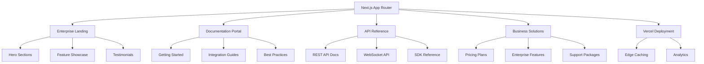

# YCQ-Website
## Enterprise Documentation & Landing Page

[](https://nextjs.org/)
[](https://www.typescriptlang.org/)
[](https://tailwindcss.com/)
[](https://vercel.com/)

> **Professional enterprise website showcasing YCQ-Sonate's AI trust platform capabilities, technical documentation, and business solutions.**

## 🎯 Overview

YCQ-Website serves as the enterprise portal for YCQ-Sonate, providing:

- **Business Landing Pages**: Professional presentation for enterprise clients
- **Technical Documentation**: Comprehensive API and integration guides
- **Interactive Trust Ledger Demo**: Live demonstration of cryptographic trust receipts
- **Case Studies**: Real-world implementations and success stories
- **Enterprise Solutions**: B2B features and pricing information
- **Developer Portal**: Technical resources and SDK documentation

## ⚡ Quick Start

```bash
# Clone the repository
git clone https://github.com/s8ken/YCQ-Website.git
cd YCQ-Website

# Install dependencies
npm install
# or
pnpm install

# Configure environment variables
cp .env.example .env.local
# Edit .env.local with your configuration

# Start development server
npm run dev
# or
pnpm dev

# Open http://localhost:3000
```

### 🔐 Trust Ledger Demo Setup

```bash
# Set the Trust Demo API endpoint
echo "NEXT_PUBLIC_TRUST_DEMO_API=https://your-demo-api.com/api" >> .env.local

# The demo is now available at:
# http://localhost:3000/trust-demo
```

## 🏗️ Architecture



## 🚀 Key Features

### 🏢 Enterprise Landing
- **Professional Design**: Clean, corporate aesthetic
- **Feature Highlights**: Key platform capabilities
- **Social Proof**: Client testimonials and case studies
- **Contact Forms**: Lead generation and sales inquiries

### 📚 Documentation Hub
- **API Documentation**: Complete REST and WebSocket reference
- **Integration Guides**: Step-by-step implementation tutorials
- **SDK Documentation**: Language-specific libraries
- **Code Examples**: Copy-paste implementation samples

### 💼 Business Solutions
- **Pricing Tiers**: Transparent pricing for different scales
- **Enterprise Features**: Advanced capabilities overview
- **ROI Calculator**: Value proposition demonstration
- **Compliance Information**: Security and regulatory compliance

### 🔧 Developer Portal
- **Interactive API Explorer**: Test endpoints directly
- **Webhook Documentation**: Event-driven integration guides
- **Status Dashboard**: System health and uptime metrics
- **Community Forum**: Developer support and discussions

### 📦 SDKs

#### JavaScript / TypeScript SDK
```bash
npm install @yseeku/trust-receipts
```

#### Python SDK (just shipped!)
```bash
pip install sonate-trust-receipts
```

**Quick Verify Example (Python)**:
```python
from sonate_trust_receipts import verify_receipt

receipt = {
    "id": "rec_9f3a2b1c8d...",
    "contentHash": "...",
    "signature": "...",
    "publicKey": "...",
    # ... full receipt JSON
}

result = verify_receipt(receipt)
print(result.valid)          # True
print(result.trustScore)     # 72.0
print(result.chainValid)     # True
```

Both packages are MIT-licensed, fully open-source, and include:
- Complete receipt schema
- Ed25519 verification
- Hash-chain validation

The Python package also ships with **digital attestations** so enterprises can cryptographically confirm the package itself was built from the public GitHub source.

## 📁 Project Structure

```
YCQ-Website/
├── app/                    # Next.js App Router
│   ├── layout.tsx         # Root layout
│   ├── page.tsx           # Homepage
│   ├── solutions/         # Business solutions
│   ├── docs/              # Documentation
│   ├── api-reference/     # API documentation
│   ├── pricing/           # Pricing pages
│   ├── about/             # Company information
│   └── contact/           # Contact forms
├── components/            # React components
│   ├── ui/               # Base UI components
│   ├── business/         # Business-focused components
│   ├── docs/             # Documentation components
│   ├── interactive/      # API explorer, demos
│   └── layout/           # Layout components
├── lib/                  # Utilities
│   ├── api-client.ts     # API client for demos
│   ├── docs-config.ts    # Documentation configuration
│   └── business-data.ts  # Business content data
├── public/               # Static assets
│   ├── images/           # Professional images
│   ├── logos/            # Client and partner logos
│   └── documents/        # White papers, PDFs
└── styles/               # Styling
    ├── globals.css       # Global styles
    └── components.css    # Component-specific styles
```

## 🌐 Page Structure

### **Business Pages**
```
/                         # Enterprise homepage
/solutions               # Business solutions overview
/solutions/ai-trust      # AI trust management
/solutions/compliance    # Compliance automation
/solutions/integration   # Integration services
/pricing                 # Pricing tiers and plans
/enterprise              # Enterprise-specific features
```

### **Documentation**
```
/docs                    # Documentation hub
/docs/getting-started    # Quick start guide
/docs/authentication     # Auth implementation
/docs/agents             # Agent management
/docs/trust-protocol     # Trust system docs
/docs/webhooks           # Event integration
/docs/sdks               # SDK documentation
```

### **API Reference**
```
/api-reference           # API documentation home
/api-reference/rest      # REST API reference
/api-reference/websocket # WebSocket API reference
/api-reference/graphql   # GraphQL API (if applicable)
/api-playground          # Interactive API testing
```

### **Business Support**
```
/about                   # Company information
/contact                 # Contact and sales
/support                 # Support resources
/case-studies            # Customer success stories
/partners                # Integration partners
```

## 🎨 Design System

### **Enterprise Color Palette**
```css
:root {
  /* Primary Brand */
  --ycq-blue: #1e40af;        /* Professional blue */
  --ycq-navy: #1e293b;        /* Deep navy */
  --ycq-cyan: #0891b2;        /* Accent cyan */
  
  /* Neutral Palette */
  --gray-50: #f8fafc;
  --gray-100: #f1f5f9;
  --gray-200: #e2e8f0;
  --gray-800: #1e293b;
  --gray-900: #0f172a;
  
  /* Success & Status */
  --green-500: #10b981;
  --red-500: #ef4444;
  --yellow-500: #f59e0b;
}
```

### **Typography Scale**
```css
/* Enterprise Typography */
.heading-xl { font-size: 3.75rem; font-weight: 800; } /* 60px */
.heading-lg { font-size: 3rem; font-weight: 700; }    /* 48px */
.heading-md { font-size: 2.25rem; font-weight: 600; } /* 36px */
.heading-sm { font-size: 1.5rem; font-weight: 600; }  /* 24px */
.body-lg { font-size: 1.125rem; }                     /* 18px */
.body-md { font-size: 1rem; }                         /* 16px */
.body-sm { font-size: 0.875rem; }                     /* 14px */
```

## 💼 Business Components

### **Pricing Table**
```tsx
const PricingTable = () => {
  const plans = [
    {
      name: "Starter",
      price: "$99/month",
      features: ["Up to 10 agents", "Basic trust scoring", "Email support"],
      cta: "Start Free Trial"
    },
    {
      name: "Professional", 
      price: "$499/month",
      features: ["Up to 100 agents", "Advanced analytics", "Priority support"],
      cta: "Contact Sales"
    },
    {
      name: "Enterprise",
      price: "Custom",
      features: ["Unlimited agents", "Custom integrations", "Dedicated support"],
      cta: "Get Quote"
    }
  ];
  
  return <PricingGrid plans={plans} />;
};
```

### **ROI Calculator**
```tsx
const ROICalculator = () => {
  const [inputs, setInputs] = useState({
    agents: 50,
    averageTaskTime: 30,
    hourlyRate: 75
  });
  
  const savings = calculateSavings(inputs);
  
  return (
    <div className="roi-calculator">
      <InputControls inputs={inputs} onChange={setInputs} />
      <SavingsDisplay savings={savings} />
    </div>
  );
};
```

## 📖 Documentation Features

### **Interactive API Explorer**
```tsx
const APIExplorer = ({ endpoint }) => {
  const [request, setRequest] = useState({});
  const [response, setResponse] = useState(null);
  
  const executeRequest = async () => {
    const result = await apiClient.call(endpoint, request);
    setResponse(result);
  };
  
  return (
    <div className="api-explorer">
      <RequestBuilder endpoint={endpoint} onChange={setRequest} />
      <ResponseViewer response={response} />
    </div>
  );
};
```

### **Code Examples**
```tsx
const CodeExample = ({ language, code }) => {
  return (
    <div className="code-example">
      <CodeHeader language={language} />
      <SyntaxHighlighter language={language}>
        {code}
      </SyntaxHighlighter>
      <CopyButton code={code} />
    </div>
  );
};
```

## 🔧 Development

### **Environment Variables**
```bash
# API Integration
NEXT_PUBLIC_API_URL=https://api.ycq-sonate.com
NEXT_PUBLIC_DOCS_URL=https://docs.ycq-sonate.com

# Analytics
NEXT_PUBLIC_GA_ID=G-XXXXXXXXXX
NEXT_PUBLIC_MIXPANEL_TOKEN=your-mixpanel-token

# Business Features
HUBSPOT_API_KEY=your-hubspot-key
STRIPE_PUBLIC_KEY=pk_live_your-stripe-key

# Content Management
CONTENTFUL_SPACE_ID=your-space-id
CONTENTFUL_ACCESS_TOKEN=your-token
```

### **Development Commands**
```bash
# Development
npm run dev              # Start dev server with hot reload
npm run build           # Build for production
npm run start           # Start production server

# Content & Data
npm run generate-docs   # Generate API docs from OpenAPI
npm run update-content  # Sync content from CMS
npm run optimize-images # Optimize image assets

# Quality Assurance
npm run lint            # ESLint + Prettier
npm run type-check      # TypeScript validation
npm run test           # Unit and integration tests
npm run lighthouse     # Performance audit
```

## 📊 Business Metrics & Analytics

### **Conversion Tracking**
```tsx
// Track business actions
const trackConversion = (action: string, value?: number) => {
  // Google Analytics
  gtag('event', action, {
    event_category: 'business',
    value: value
  });
  
  // Mixpanel
  mixpanel.track(action, { value });
  
  // HubSpot
  if (action === 'contact_form_submit') {
    hubspot.track('form_submission', { form_name: 'contact' });
  }
};
```

### **A/B Testing**
```tsx
// Feature flag-based A/B testing
const PricingSection = () => {
  const variant = useFeatureFlag('pricing_design_v2');
  
  return variant === 'v2' 
    ? <PricingTableV2 />
    : <PricingTableV1 />;
};
```

## 🚀 Performance & SEO

### **Core Web Vitals Optimization**
- **LCP**: < 2.5s with optimized images and fonts
- **FID**: < 100ms with minimal JavaScript
- **CLS**: < 0.1 with reserved layout space

### **SEO Features**
```tsx
// Dynamic meta tags for business pages
export function generateMetadata({ params }) {
  return {
    title: `${params.solution} Solution - YCQ-Sonate`,
    description: `Enterprise ${params.solution} with AI trust protocol`,
    openGraph: {
      title: `${params.solution} - YCQ-Sonate`,
      description: `Professional ${params.solution} platform`,
      images: [`/images/solutions/${params.solution}-og.jpg`]
    }
  };
}
```

## 🔗 Integration Capabilities

### **CRM Integration (HubSpot)**
```typescript
// Lead capture and management
const submitContactForm = async (formData: ContactForm) => {
  const lead = await hubspot.contacts.create({
    properties: {
      email: formData.email,
      company: formData.company,
      hs_lead_status: 'NEW'
    }
  });
  
  // Trigger sales notification
  await hubspot.engagements.create({
    type: 'TASK',
    associations: { contactIds: [lead.vid] }
  });
};
```

### **Payment Integration (Stripe)**
```typescript
// Pricing and subscription handling
const createSubscription = async (priceId: string) => {
  const session = await stripe.checkout.sessions.create({
    payment_method_types: ['card'],
    line_items: [{ price: priceId, quantity: 1 }],
    mode: 'subscription',
    success_url: `${baseUrl}/welcome`,
    cancel_url: `${baseUrl}/pricing`
  });
  
  return session.url;
};
```

## 📱 Mobile Enterprise Experience

### **Responsive Breakpoints**
```css
/* Mobile-first enterprise design */
@media (min-width: 640px)  { /* sm: tablet */ }
@media (min-width: 768px)  { /* md: small laptop */ }
@media (min-width: 1024px) { /* lg: desktop */ }
@media (min-width: 1280px) { /* xl: large desktop */ }
@media (min-width: 1536px) { /* 2xl: ultra-wide */ }
```

### **Progressive Web App Features**
- Service worker for offline documentation
- App-like navigation on mobile
- Fast loading with critical CSS inlining

## 📄 License & Compliance

### **Enterprise License**
Licensed under Enterprise Commercial License. See [LICENSE](LICENSE) for terms.

### **Compliance Standards**
- **SOC 2 Type II**: Security and availability
- **GDPR**: Data protection compliance  
- **CCPA**: California privacy compliance
- **HIPAA**: Healthcare data handling (where applicable)

## 🤝 Contributing

### **Content Contributions**
- Case study submissions
- Documentation improvements
- Business use case examples
- Industry-specific guides

### **Technical Contributions**
- Performance optimizations
- Accessibility improvements
- Mobile experience enhancements
- Integration examples

## 📞 Business Contact

### **Sales & Partnerships**
- **Sales**: sales@ycq-sonate.com
- **Partnerships**: partners@ycq-sonate.com
- **Enterprise**: enterprise@ycq-sonate.com

### **Technical Support**
- **Documentation**: [https://docs.ycq-sonate.com](https://docs.ycq-sonate.com)
- **Developer Support**: developers@ycq-sonate.com
- **Status Page**: [https://status.ycq-sonate.com](https://status.ycq-sonate.com)

### **Company Information**
- **Website**: [https://ycq-sonate.com](https://ycq-sonate.com)
- **LinkedIn**: [YCQ-Sonate](https://linkedin.com/company/ycq-sonate)
- **Twitter**: [@YCQSonate](https://twitter.com/YCQSonate)

---

## 🔐 Trust Ledger Demo

### **Interactive Demo Features**

The Trust Ledger Demo provides a live, interactive demonstration of SONATE's cryptographic trust infrastructure:

- **📊 Trust Analytics**: Real-time compliance metrics and trust scores
- **✨ Create Declarations**: Build trust declarations with 6 fundamental articles
- **🤖 AI + Trust Receipts**: Generate AI responses with automatic cryptographic receipts
- **🔍 Verify Receipts**: One-click cryptographic verification of trust receipts

### **Demo Access**

**URL**: [https://www.ycq.com/trust-demo](https://www.ycq.com/trust-demo)

**Demo Credentials**:
- Email: `demo@sonate-trust.com`
- Password: `demo123`

**Demo Limits**:
- 50 requests per 15 minutes
- Data purged every 24 hours
- No real API keys or sensitive data

### **Documentation**

- **Security**: See [TRUST_DEMO_SECURITY.md](./TRUST_DEMO_SECURITY.md)
- **Deployment**: See [TRUST_DEMO_DEPLOYMENT.md](./TRUST_DEMO_DEPLOYMENT.md)

---

> *"Empowering enterprises with trustworthy AI agent management at scale."*